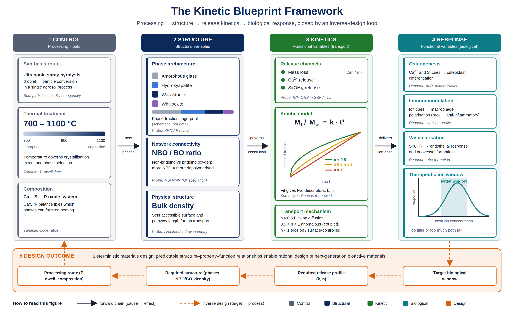
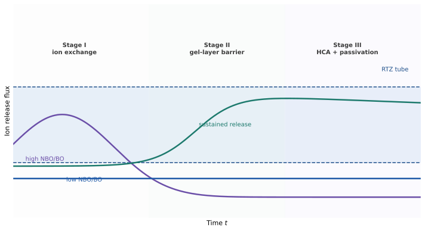
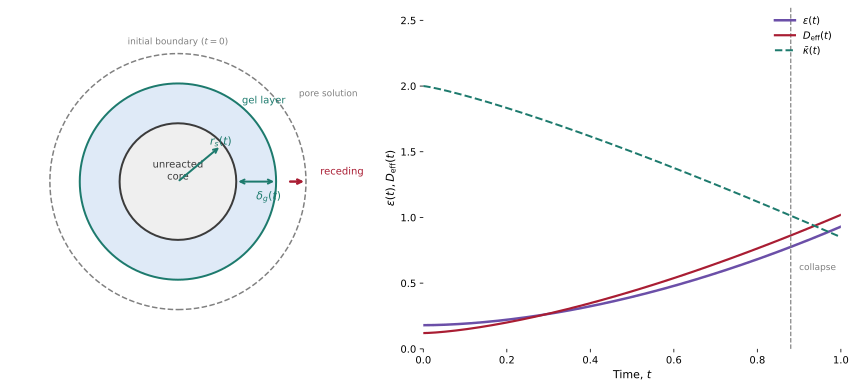
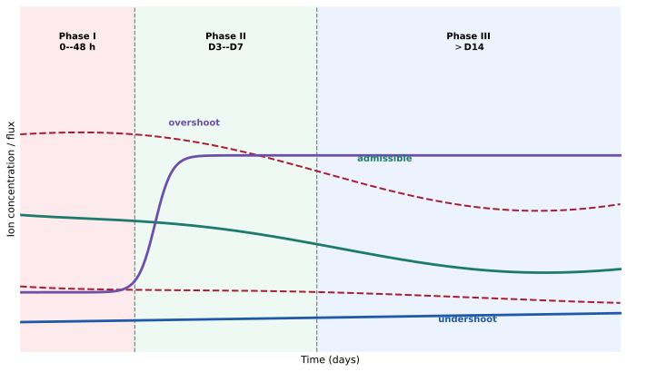

# Spatiotemporal Modeling of Bioactive Silicate Ceramics

[](requirements.txt)
[](tests/)
[](LICENSE)
[](https://doi.org/10.5281/zenodo.21759552)

## Overview

This repository models bioactive silicate ceramics (apatite–wollastonite glass-ceramics) not just by static composition or endpoint bioactivity, but as a coupled, time-resolved process:

**network chemistry → ion release → transport → pH/supersaturation → mineralization**

The model combines:
- solid-state reaction kinetics (Arrhenius-type crystallization),
- moving-boundary dissolution and pore-transport equations,
- Damköhler–Péclet dimensionless analysis to classify reaction- vs. transport-limited regimes,
- a defined target range ("regenerative target zone") that acceptable ion-release trajectories must stay within over time.

## Figures

<p align="center">
  
</p>

<p align="center">
  
</p>

<p align="center">
  
</p>

<p align="center">
  
</p>

<p align="center">
  
</p>

Additional figures: [phase evolution](docs/assets/legacy_figures/figures__characterization__xrd_phase_evolution.png), [feature importance](docs/assets/legacy_figures/figures__feature_importance.png), [hydroxyapatite gain](docs/assets/legacy_figures/figures__hydroxyapatite_gain_day21.png), [initial phase composition](docs/assets/legacy_figures/figures__initial_phase_composition.png), [mass-loss profiles](docs/assets/legacy_figures/figures__mass_loss_profiles.png), [predicted vs. experimental phases](docs/assets/legacy_figures/figures__predicted_vs_experimental_phase_fractions.png), [SBF hydroxyapatite evolution](docs/assets/legacy_figures/figures__sbf_hydroxyapatite_evolution.png), [SBF wollastonite evolution](docs/assets/legacy_figures/figures__sbf_wollastonite_evolution.png).

## Governing equations

Concentration transport:

$$
\frac{\partial C_i}{\partial t}+\nabla\cdot(\mathbf u C_i)
=\nabla\cdot\left(D_{\mathrm{eff}}(t)\nabla C_i\right)+S_i-R_i.
$$

Dissolution-driven porosity change:

$$
\frac{\partial\varepsilon}{\partial t}
=k_{\mathrm{diss}}^{\circ}\alpha\beta\bar V_m,
\qquad
\beta(t)=\frac{3[1-\varepsilon(t)]}{r_s(t)}.
$$

Dimensionless regime coordinates:

$$
\mathrm{Da}=\frac{k_{\mathrm{diss}}^{\circ}\alpha\beta_0L^2}{D_{\mathrm{eff}} C_0},
\qquad
\mathrm{Pe}=\frac{UL}{D_{\mathrm{eff}}}.
$$

The balanced regime is Da ~ 1 and Pe ~ 1, where reaction and transport rates are comparable.

## Quickstart

```bash
python -m pip install -r requirements.txt
python scripts/generate_figures.py
pytest -q
```

Minimal example (forward solve + target-range check):

```python
import numpy as np
from kineticai import admissible_tube, simulate_moving_boundary_1d

material = {"alpha": 0.38, "k_diss": 0.016}
result = simulate_moving_boundary_1d(
    tmax=28.0, dt=0.05, nx=96,
    alpha=material["alpha"], k_diss=material["k_diss"],
    diffusivity=0.004,
)

trajectory = np.column_stack([
    np.full(len(result["time_grid"]), 0.55),
    np.full(len(result["time_grid"]), 0.50),
    np.full(len(result["time_grid"]), 0.25),
    np.full(len(result["time_grid"]), 7.70),
    result["porosity_history"].mean(axis=1),
])
lower = np.tile([0.15, 0.10, 0.05, 7.35, 0.20], (len(trajectory), 1))
upper = np.tile([1.10, 1.00, 0.60, 8.20, 0.85], (len(trajectory), 1))
print("Within target range:", admissible_tube(trajectory, lower, upper))
```

Notebooks: [01_moving_boundary_simulation.ipynb](notebooks/01_moving_boundary_simulation.ipynb), [02_da_pe_regime_and_rtz_optimization.ipynb](notebooks/02_da_pe_regime_and_rtz_optimization.ipynb).

## Experimental-data pipeline

```text
data/raw/*.csv → src/data_processing.py → data/processed/awgc_ml_dataset.csv → src/models.py (metrics)
data/raw/*.csv → src/visualization.py → figures/*.png
```

```bash
python src/data_processing.py
python src/models.py
python src/visualization.py
jupyter notebook notebooks
```

Current transport-model fits, including Korsmeyer–Peppas analysis for 700 °C and 1100 °C samples, are in [docs/model_validation.md](docs/model_validation.md). Note: current model evaluation uses a random train/test split; leave-one-temperature-out validation is not yet implemented.

## Documentation

| Topic | Document |
|---|---|
| Solid-state chemistry and Arrhenius reactivity | [01_solid_state_chemistry.md](docs/theory/01_solid_state_chemistry.md) |
| Moving-boundary PDE and transport | [02_moving_boundary_pde.md](docs/theory/02_moving_boundary_pde.md) |
| Damköhler–Péclet scaling | [03_damkohler_peclet_scaling.md](docs/theory/03_damkohler_peclet_scaling.md) |
| Target-zone definition | [04_regenerative_target_zone.md](docs/theory/04_regenerative_target_zone.md) |
| SciML / Bayesian validation | [05_sciml_bayesian_pipeline.md](docs/theory/05_sciml_bayesian_pipeline.md) |
| Manuscript source | [docs/trajectory_engineering.tex](docs/trajectory_engineering.tex) |
| Equation inventory | [docs/equations_reference.md](docs/equations_reference.md) |

## Publications

- Workie, Ningsih, Yeh, and Shih, "An Investigation of In Vitro Bioactivities and Cytotoxicities of Spray Pyrolyzed Apatite–Wollastonite Glass-Ceramics," *Crystals* (2023). [DOI](https://doi.org/10.3390/cryst13071049)
- Workie and Shih, "A Kinetic Blueprint for Bioactive Ceramics: Programming the Bio-interface through Thermal Processing," *Ceramics International* (2025). [DOI](https://doi.org/10.1016/j.ceramint.2025.11.191)
- Workie and Taye, "Sequential Crystallization Pathways in Apatite–Wollastonite Glass-Ceramics via Spray Pyrolysis," *RSC Advances* (2026). [DOI](https://doi.org/10.1039/d5ra08885b)
- Workie, Taye, Melchels, and Mamo, "Predictive Mass-Transport Kinetics in Phase-Programmed Silicate Glass-Ceramics for Controlled Microenvironmental Engineering," *Biomaterials Science* (2026). [DOI](https://doi.org/10.1039/D6BM00997B)
- Taye, Workie, and Shih, "Rational Engineering of Mesoporous Bioactive Glass Surface Reactivity: NBO/BO Ratio Control via Synergistic Ag and Ce Co-Doping by Spray Pyrolysis," *Ceramics International* (2026). [DOI](https://doi.org/10.1016/j.ceramint.2026.01.486)

Full context: [docs/publications.md](docs/publications.md)

## Repository structure

```text
KineticAI-AWGC/
├── data/          # Raw and processed experimental datasets
├── notebooks/     # Analysis workflow and demonstrations
├── src/           # Data, chemistry, transport, and analysis modules
├── docs/          # Manuscript, theory, equations, publications
├── results/       # Model-validation and trajectory summaries
├── figures/       # Generated figures
├── scripts/       # Figure-generation utilities
├── tests/         # Physics and math regression tests
├── requirements.txt
├── CITATION.cff
└── LICENSE
```

## Citation

```bibtex
@software{workie_kineticai_awgc,
  author  = {Workie, Andualem Belachew},
  title   = {KineticAI-AWGC: Spatiotemporal Modeling of Bioactive Silicate Ceramics},
  year    = {2025},
  doi     = {10.5281/zenodo.21759552},
  url     = {https://github.com/andualembelachew2/KineticAI-AWGC}
}
```

MIT License. Citation: [CITATION.cff](CITATION.cff).

## Contact

- GitHub: [andualembelachew2](https://github.com/andualembelachew2)
- ORCID: [0000-0003-3162-4257](https://orcid.org/0000-0003-3162-4257)
