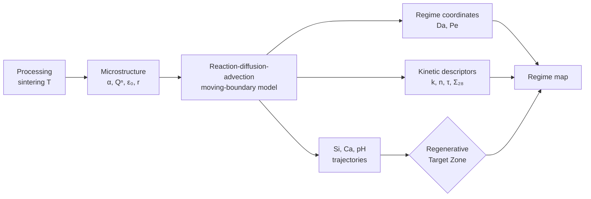

# Kinetic Blueprint: A Computational Framework for Programmable Ion Release in Bioactive Glass-Ceramics

**Kinetic Blueprint** is a simulation and analysis framework that connects *processing* (sintering temperature) to *microstructure* (amorphous fraction, connectivity, porosity), to *dissolution kinetics*, to the *ion-release trajectory*, and finally to a *biological admissibility check*. It is built around apatite-wollastonite glass-ceramic (AWGC) scaffolds, and the same logic can be applied to other silicate bioceramics.

[](#license)
[](https://doi.org/10.5281/zenodo.21759552)


---

## 1. Concept

Instead of reporting release curves after the fact, the framework treats the release **trajectory** as a design target:



---

## 2. Mathematical model

### 2.1 Governing equations

Ion transport (Si and Ca) in a one-dimensional pore domain:

$$
\frac{\partial C}{\partial t} + u\,\frac{\partial C}{\partial x}
= \frac{\partial}{\partial x}\!\left(D_{\mathrm{eff}}(\varepsilon)\,\frac{\partial C}{\partial x}\right) + S(x,t) - R(x,t)
$$

Moving-boundary evolution of the solid matrix:

$$
\frac{\partial \varepsilon}{\partial t} = k_{\mathrm{diss}}\,\alpha\,\beta(t)\,V_m\left(1-\frac{C}{C_{\mathrm{sat}}}\right),
\qquad
\frac{\mathrm{d}r}{\mathrm{d}t} = -k_{\mathrm{diss}}\,V_m\left(1-\frac{C}{C_{\mathrm{sat}}}\right)
$$

### 2.2 Constitutive closures

| Quantity | Closure |
|---|---|
| Specific surface area | β = 3(1 − ε) / r |
| Effective diffusivity | D_eff = D₀ · ε^1.5 (Archie-type) |
| Driving force | Si undersaturation, 1 − C_Si / C_sat,Si (clipped to [0, 1]) |
| Congruent release | S_Ca = 3 · S_Si (Ca/Si = 3.0) |
| Ca sink | HCA-type precipitation, R = 0.15 · max(C_Ca − 2.5, 0)^1.5 |
| Boundaries | Zero flux at the strut wall (x = 0); zero gradient at the pore exit (x = L) |
| Discretisation | Central differences (diffusion), upwind (advection), explicit time stepping |

---

## 3. Analysis layers

### 3.1 Regime coordinates

$$
\mathrm{Da}=\frac{k_{\mathrm{diss}}\,\alpha\,\beta_0\,L^2}{D_{\mathrm{eff}}\,C_0},
\qquad
\mathrm{Pe}=\frac{U\,L}{D_{\mathrm{eff}}}
$$

| Region | Da | Regime | Expected behaviour |
|:---:|:---:|---|---|
| I | > 2 | Reactive burst | Dissolution outpaces transport |
| II | 0.5 – 2 | Balanced | Reaction and transport comparable |
| III | < 0.5 | Transport-limited | Slow, sustained release |

### 3.2 Release-kinetics descriptors

| Descriptor | Definition |
|---|---|
| **k, n** | Korsmeyer-Peppas fit, M_t / M_∞ = k · tⁿ, on the first ~60% of mass loss (bounds: k ∈ [10⁻⁴, 5], n ∈ [0.05, 1.2]) |
| **R²** | Goodness of the power-law fit |
| **Σ₂₈** | 28-day cumulative dose, ∫₀²⁸ C(t) dt (mM·day) |
| **τ** | Half-dose arrival time: first day cumulative dose reaches 0.5 · Σ₂₈ |

Together, (τ, Σ₂₈) places each material at a point in a **trajectory space**, and Da places it on the **regime map**.

### 3.3 Regenerative Target Zone (RTZ)

A trajectory is admissible if the fraction of time points satisfying *all* bounds meets a pre-registered tolerance.

| Variable | Admissible range |
|---|---|
| Silicon | 0.2 – 1.5 mM |
| Calcium | 1.0 – 5.0 mM |
| pH | 7.35 – 7.85 |
| **Tolerance** | ≥ 85% of time points in-zone |

The figure additionally marks pH > 8.2 as an alkaline-shock (cytotoxic) region.

---

## 4. Reference material set

Three sintering conditions span the three regimes (150 µm struts, 28-day window):

| ID | Sintering T (°C) | α | k_diss,0 (mol m⁻² day⁻¹) | Qⁿ | ε₀ | ρ (g cm⁻³) |
|:---:|:---:|:---:|:---:|:---:|:---:|:---:|
| 700C | 700 | 0.522 | 0.0471 | 1.85 | 0.35 | 2.02 |
| 900C | 900 | 0.360 | 0.0185 | 2.40 | 0.28 | 2.61 |
| 1100C | 1100 | 0.226 | 0.00455 | 3.20 | 0.18 | 2.78 |

Higher sintering temperature lowers the reactive amorphous fraction and raises network connectivity, which slows dissolution.

---

## 5. Software architecture

```
src/
└── kinetic_blueprint.py
    ├── CeramicParameters                  # material descriptor (dataclass)
    ├── MovingBoundaryDissolutionSolver    # forward PDE simulation
    ├── KineticBlueprintAnalyzer           # Da, Pe, k, n, τ, Σ₂₈
    ├── RegenerativeTargetZone             # admissibility validator
    └── generate_framework_figure()        # 4-panel figure export
```

---

## 6. Usage

```bash
pip install numpy scipy matplotlib
python src/kinetic_blueprint.py
```

Outputs per material: regime, (Da, Pe), (n, k, R²), (τ, Σ₂₈) and RTZ pass/fail with percentage in-zone. Figures are written to `figures/exports/` as SVG and 600 DPI PNG:

| Panel | Content |
|:---:|---|
| a | Cumulative mass loss and exponent n |
| b | pH trajectories against the RTZ band and alkaline-shock band |
| c | Si vs. Ca release against the 3:1 congruent line |
| d | (τ, Σ₂₈) trajectory space annotated with Da |

### Applying it to a new material

```python
from src.kinetic_blueprint import (
    CeramicParameters, MovingBoundaryDissolutionSolver,
    KineticBlueprintAnalyzer, RegenerativeTargetZone,
)

mat = CeramicParameters(
    name="custom", temp_c=800.0, alpha=0.45, k_diss_0=0.03,
    q_n_connectivity=2.1, initial_porosity=0.30,
    strut_radius_um=150.0, bulk_density_g_cm3=2.3,
)

sim = MovingBoundaryDissolutionSolver(mat, t_max_days=28.0).run_simulation()
da, pe, regime = KineticBlueprintAnalyzer.compute_dimensionless_numbers(mat)
k, n, r2 = KineticBlueprintAnalyzer.fit_korsmeyer_peppas(
    sim["time_days"], sim["cumulative_mass_loss"])
tau, sigma28 = KineticBlueprintAnalyzer.compute_trajectory_descriptors(
    sim["time_days"], sim["c_si_effluent"])
rtz = RegenerativeTargetZone().check_admissibility(
    sim["time_days"], sim["c_si_effluent"], sim["c_ca_effluent"], sim["ph_effluent"])
```

---

## 7. Model scope

- One-dimensional, single-strut-scale transport; no 3D scaffold geometry.
- pH is a phenomenological proxy tied to effluent Ca and amorphous fraction, not a full speciation calculation.
- RTZ bounds and the 85% tolerance are design thresholds and should be re-derived for each cell type or application.
- Parameters in the reference set should be calibrated against experimental release data before quantitative use.

---

## Citation

Please cite the archived release: **doi:10.5281/zenodo.21759552**

## License

MIT
