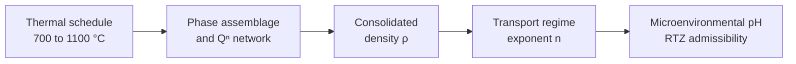

# Kinetic Blueprint Framework: Experimental Foundation

The framework is calibrated on spray-pyrolyzed apatite-wollastonite glass-ceramics (AWGCs) processed across a five-point thermal schedule. This section summarises how thermal history changes **phase assemblage, network connectivity, density and ion-release kinetics**, which are the physical basis for the model parameters (α, Qⁿ, ε₀, k_diss, n).

---

## 1. Thermal processing window

| Temperature | State of the material |
|:---:|---|
| 700 °C | Pre-crystallisation amorphous precursor |
| 800 °C | Onset of crystallisation |
| 900 °C | Intermediate multi-phase development |
| 1000 °C | Maximum densification |
| 1100 °C | Phase-stabilised crystalline state |

---

## 2. Phase evolution and network connectivity

Heat treatment shifts material from the reactive amorphous phase into crystalline phases and polymerises the silicate network.

| Property | 700 °C | 1100 °C | Trend |
|---|:---:|:---:|---|
| Amorphous content (wt%) | 52.20 | 22.60 | Decreases progressively |
| Wollastonite, β-CaSiO₃ (wt%) | 4.00 | 21.67 | Increases monotonically |
| Whitlockite, Ca₃(PO₄)₂ (wt%) | 8.00 | 43.34 | Increases; forms a stable orthophosphate core |
| NBO/BO ratio | 6.35 | 2.10 | Decreases: a more polymerised, densified silicate network |

**Data:** `data/processed/phase_composition.csv`

---

## 3. Densification and consolidation

Viscous sintering closes intergranular porosity and consolidates the matrix.

| Temperature | Bulk density ρ (g cm⁻³) | Note |
|:---:|:---:|---|
| 700 °C | 2.02 | Under-consolidated, porous |
| 1000 °C | 2.80 | Maximum measured density |
| 1100 °C | 2.78 | Dense, stabilised structure |

**Data:** `data/processed/density_evolution.csv`

---

## 4. Ion-release kinetics

Thermal history changes the 21-day dissolution behaviour while the **congruent 3:1 Ca/Si release stoichiometry is preserved**. Release is described by the Korsmeyer-Peppas model, M_t / M_∞ = k · tⁿ.

| Temperature | n | k (day⁻ⁿ) | Cumulative mass loss | pH | Transport character |
|:---:|:---:|:---:|:---:|:---:|---|
| 700 °C | 0.25 | 4.71 × 10⁻² | 10.20% | 8.38 | Burst-dominated release; early alkaline shock |
| 800–1000 °C | 0.38 – 0.49 | see dataset | see dataset | see dataset | Intermediate: matrix degradation balanced by surface mineralisation |
| 1100 °C | 0.58 | 4.55 × 10⁻³ | 2.59% | 7.82 | Diffusion-controlled; mass loss restricted; pH within the homeostatic window |

**Data:**
- `data/processed/transport_kinetics.csv`
- `data/processed/korsmeyer_peppas_parameters.csv`

---

## 5. Governing causal sequence

$$
\underbrace{\text{Thermal schedule}}_{700\text{–}1100\,^{\circ}\mathrm{C}}
\;\rightarrow\;
\underbrace{\text{Phase assemblage},\ Q^n}_{\text{network state}}
\;\rightarrow\;
\underbrace{\rho}_{\text{consolidation}}
\;\rightarrow\;
\underbrace{n}_{\text{transport regime}}
\;\rightarrow\;
\underbrace{\text{pH}}_{\text{RTZ admissibility}}
$$

The data support the crystalline state acting as a **physical throttle on delivery kinetics**: more crystalline, denser material releases ions more slowly and through a more diffusion-controlled path, keeping the microenvironment inside the target pH window. This trend is the empirical basis for the Kinetic Blueprint design logic.
