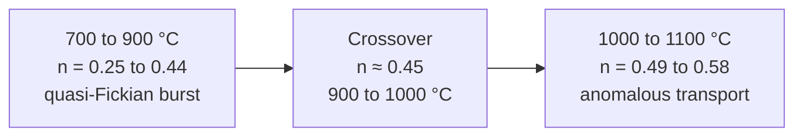

# Model Validation: Dissolution Kinetics and Ion-Release Equations

## 1. Objective

Establish the governing equations and transport mechanisms for **mass loss, stoichiometric ion release and interfacial kinetics** in phase-programmed apatite-wollastonite glass-ceramics (AWGCs), and quantify how sintering temperature changes them.

---

## 2. Kinetic dissolution models

Fractional mass loss, $M_t/M_\infty$, measured over **21 days in Simulated Body Fluid (SBF)** was evaluated against four classical formulations.

| # | Model | Equation | Physical meaning |
|:---:|---|---|---|
| 2.1 | Zero-order | $\dfrac{M_t}{M_\infty}=k_0\,t$ | Constant dissolution rate |
| 2.2 | First-order | $\dfrac{M_t}{M_\infty}=1-e^{-k_1 t}$ | Concentration-dependent dissolution |
| 2.3 | Higuchi | $\dfrac{M_t}{M_\infty}=k_H\,t^{0.5}$ | Planar Fickian diffusion |
| 2.4 | Korsmeyer-Peppas | $\dfrac{M_t}{M_\infty}=k\,t^{n}$ | Coupled erosion and diffusion |

The Korsmeyer-Peppas model is linearised for fitting as:

$$
\ln\!\left(\frac{M_t}{M_\infty}\right)=\ln k + n\ln t
$$

where $k$ is the kinetic rate constant (day⁻ⁿ) and $n$ is the transport exponent. Its value diagnoses the release mechanism (limits for cylindrical geometry):

| Exponent | Mechanism |
|:---:|---|
| $n \le 0.45$ | Quasi-Fickian burst release (matrix dissolution front) |
| $0.45 < n < 0.89$ | Anomalous transport (coupled diffusion and relaxation) |
| $n \ge 0.89$ | Case II transport (zero-order surface erosion) |

---

## 3. Multi-ion release equations

Ion release is described by coupled source-and-sink balances.

### 3.1 Silicon dissolution (matrix tracer)

Silicon traces dissolution of the amorphous network. The areal dissolution flux and the resulting volumetric source term are:

$$
J_{\mathrm{Si}}(t)=k^{\circ}_{\mathrm{diss}}\,\alpha\left(1-\frac{C_{\mathrm{Si}}(t)}{C_{\mathrm{Si,sat}}}\right),
\qquad
S_{\mathrm{Si}}(t)=\beta(t)\,J_{\mathrm{Si}}(t)
$$

| Symbol | Meaning | Units |
|:---:|---|---|
| $k^{\circ}_{\mathrm{diss}}$ | Intrinsic network hydrolysis rate constant | mol m⁻² day⁻¹ |
| $\alpha$ | Reactive amorphous fraction, $0\le\alpha\le1$ | – |
| $\beta(t)$ | Specific interfacial area per unit volume | m² m⁻³ |
| $C_{\mathrm{Si,sat}}$ | Silica saturation concentration in the medium | mM |

### 3.2 Congruent Ca/Si release ratio

Primary matrix dissolution proceeds with a fixed molar ratio:

$$
R_{\mathrm{Ca/Si}}=\frac{[\mathrm{Ca}^{2+}]_{\mathrm{release}}}{[\mathrm{Si}^{4+}]_{\mathrm{release}}}\approx 3.00\pm0.02
$$

### 3.3 Net calcium balance (dissolution vs. precipitation)

Calcium is released by the matrix and consumed by secondary hydroxycarbonate apatite (HCA) mineralisation:

$$
S^{\mathrm{net}}_{\mathrm{Ca}}(t)=\underbrace{3.00\,S_{\mathrm{Si}}(t)}_{\text{matrix dissolution source}}-\underbrace{R_{\mathrm{HCA}}(t)}_{\text{apatite precipitation sink}},
\qquad
R_{\mathrm{HCA}}=k_{\mathrm{precip}}\,(\Omega_{\mathrm{HCA}}-1)^{p}
$$

where $\Omega_{\mathrm{HCA}}$ is the HCA supersaturation ratio.

### 3.4 Moving-boundary interface velocity

The regression velocity of the strut surface follows from the areal ion fluxes:

$$
v_{\mathrm{int}}=-\frac{1}{\rho_{\mathrm{bulk}}}\sum_i M_i\,J_i
\;\;\Longleftrightarrow\;\;
\frac{\mathrm{d}r}{\mathrm{d}t}=-k_{\mathrm{diss}}\,V_m\left(1-\frac{C}{C_{\mathrm{sat}}}\right)
$$

with $M_i$ the molar mass of species $i$ and $V_m$ the molar volume of the glass.

---

## 4. Model-fitting results

Korsmeyer-Peppas parameters for each sintering condition (21 days in SBF):

| Sintering T | $n$ | $k$ (day⁻ⁿ) | $R^2$ | Transport classification |
|:---:|:---:|:---:|:---:|---|
| **700 °C** | 0.25 | $4.71\times10^{-2}$ | 0.993 | Quasi-Fickian burst release |
| **800 °C** | 0.38 | $2.95\times10^{-2}$ | 0.991 | Quasi-Fickian |
| **900 °C** | 0.44 | $1.85\times10^{-2}$ | 0.994 | Quasi-Fickian (near Fickian limit) |
| **1000 °C** | 0.49 | $9.20\times10^{-3}$ | 0.995 | Anomalous (diffusion-relaxation) |
| **1100 °C** | 0.58 | $4.55\times10^{-3}$ | 0.997 | Anomalous, diffusion-dominated |

---

## 5. Summary of physical findings

1. **Mechanism transition.** Rising sintering temperature moves release from rapid quasi-Fickian burst dissolution ($n=0.25$ at 700 °C) to anomalous, diffusion-dominated transport ($n=0.58$ at 1100 °C), with the crossover at $n\approx0.45$ between 900 and 1000 °C.
2. **Stoichiometric invariance.** At every processing temperature, initial release keeps a congruent $[\mathrm{Ca}^{2+}]/[\mathrm{Si}^{4+}]$ molar ratio of about 3.00.
3. **Rate-constant control.** Sintering temperature lowers $k$ roughly tenfold ($4.71\times10^{-2}\rightarrow4.55\times10^{-3}$ day⁻ⁿ) without changing release stoichiometry, consistent with solid-state crystallisation acting as the control on release kinetics.
