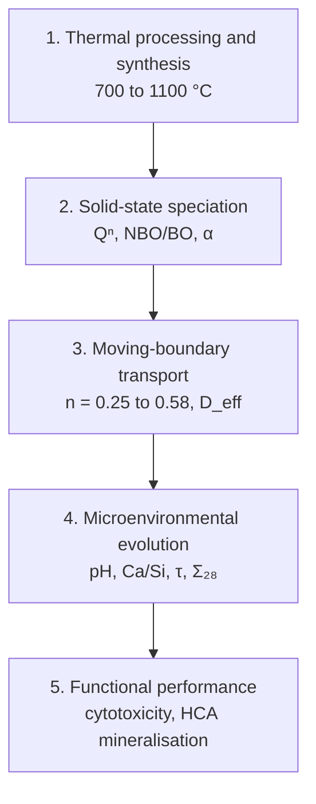

# KineticAI-AWGC: Computational Platform for Predictive Trajectory Engineering

**KineticAI-AWGC** is an open-source scientific computing platform that couples thermal processing, solid-state speciation (Qⁿ, NBO/BO), moving-boundary reaction-diffusion PDEs and interfacial cellular response in bioactive glass-ceramics. It implements the **Kinetic Blueprint Framework**: a causal map from *how a ceramic is processed* to *how it releases ions* and *how cells respond*.

---

## 1. Materials system

| Property | Description |
|---|---|
| **Platform** | Spray-pyrolysed apatite-wollastonite glass-ceramics (AWGCs) |
| **Compositional domain** | 3CaO·2SiO₂ – 3CaO·P₂O₅ – CaF₂ |
| **Thermal window** | 700–1100 °C (two-stage sinter-crystallisation) |
| **Crystalline phases** | Wollastonite (β-CaSiO₃), whitlockite (Ca₃(PO₄)₂), fluorapatite (Ca₅(PO₄)₃F) |
| **Residual matrix** | Calcium-rich amorphous silicate network, 22.6–52.2 wt% |

---

## 2. Kinetic Blueprint causal hierarchy

| # | Stage | Domain | Inputs | Governing physics | Outputs |
|:---:|---|---|---|---|---|
| 1 | **Thermal processing and synthesis** | Solid-state pyrolysis, viscous sintering | Sintering temperature (700–1100 °C), aerosol droplet residence time | Arrhenius crystallisation, $k_{\mathrm{cryst}}=A\,e^{-E_a/RT}$ | Phase distribution; bulk density (2.02 → 2.80 g cm⁻³) |
| 2 | **Solid-state speciation and phase architecture** | Silicate network chemistry | Phase fractions (XRD), NBO/BO (XPS), Qⁿ speciation (²⁹Si NMR) | Network depolymerisation metrics | Hydrolysis rate constant $k(Q^n)$; reactive amorphous fraction α |
| 3 | **Moving-boundary transport** | Coupled reaction-diffusion PDE | $D_{\mathrm{eff}}(\varepsilon)$, pore-fluid velocity $u$, specific area $\beta(t)$ | Advection-diffusion-dissolution with moving boundary | Korsmeyer-Peppas n (0.25 → 0.58); evolving porosity ε(t) |
| 4 | **Microenvironmental evolution** | Dynamic interfacial SBF solution | Ion fluxes $J_{\mathrm{Ca}}$, $J_{\mathrm{Si}}$; baseline buffers | Congruent release, [Ca²⁺]/[Si⁴⁺] ≈ 3.00; pH(t) = 7.40 + ΔpH(exchange) | 28-day dose Σ₂₈; arrival time τ; interfacial pH |
| 5 | **Functional performance and bioactivity** | Cellular response, mineralisation | (τ, Σ₂₈) coordinates; target-zone envelopes | ISO 10993-5 viability (> 70% = non-cytotoxic); HCA nucleation $R_{\mathrm{HCA}}(\Omega)$ | HCA surface coverage (13.7–78.4%); osteogenic upregulation (> 300%) |

---

## 3. Governing equations

**Network depolymerisation.** With $T$ the network-forming cations and $O$ the total oxygen:

$$
\mathrm{NBO}=2\,[O]-4\,[T],
\qquad
\frac{\mathrm{NBO}}{T}=\frac{2[O]-4[T]}{[T]},
\qquad
\frac{\mathrm{NBO}}{\mathrm{BO}}=\frac{\mathrm{NBO}}{[O]-\mathrm{NBO}}
$$

**Release kinetics (Korsmeyer-Peppas):**

$$
\frac{M_t}{M_\infty}=k\,t^{n}
$$

**Congruent dissolution:**

$$
R_{\mathrm{Ca/Si}}=\frac{[\mathrm{Ca}^{2+}]}{[\mathrm{Si}^{4+}]}\approx 3.00
$$

**Moving-boundary transport (species *i*):**

$$
\frac{\partial C_i}{\partial t}+\nabla\!\cdot(\mathbf{u}\,C_i)=\nabla\!\cdot\!\big(D_{\mathrm{eff}}(\varepsilon)\,\nabla C_i\big)+S_i-R_i
$$

**Interface velocity** (areal fluxes $J_i$, molar masses $M_i$):

$$
v_{\mathrm{int}}=-\frac{1}{\rho_{\mathrm{bulk}}}\sum_i M_i\,J_i
$$

**Regime numbers:**

$$
\mathrm{Da}=\frac{k^{\circ}_{\mathrm{diss}}\,\alpha\,\beta_0\,L^{2}}{D_{\mathrm{eff}}\,C_0},
\qquad
\mathrm{Pe}=\frac{U\,L}{D_{\mathrm{eff}}}
$$

**Trajectory descriptors.** For each species *i*, define the cumulative dose

$$
D_i(t)=\int_0^{t} C_i(t')\,\mathrm{d}t'
$$

The **28-day cumulative dose** is the total accumulated up to day 28:

$$
\Sigma^{i}_{28}=D_i(28)=\int_0^{28} C_i(t)\,\mathrm{d}t
\;\approx\;\sum_j C_i(t_j)\,\Delta t_j
$$

The **half-dose arrival time** is the earliest time at which half of that dose has accumulated:

$$
\tau^{i}=\min\big(t\in[0,28]\;:\;D_i(t)\ge 0.5\,\Sigma^{i}_{28}\big)
$$

---

## 4. Data infrastructure

| Dataset | File | Size | Key variables |
|---|---|:---:|---|
| **Sintering phase kinetics** | `data/raw/sintering_phase_kinetics.csv` | 5 × 13 | `Temperature_C`, `Amorphous_Percent`, `Bulk_Density_g_cm3`, `Kinetic_Exponent_n` |
| **In vitro cytotoxicity (ISO 10993)** | `data/raw/cytotoxicity_iso10993.csv` | 30 × 5 | `Extract_Percent`, `Sintering_Temp_C`, `Cell_Viability_Percent`, `ISO_10993_Status` |
| **SBF pH dynamics (21 d)** | `data/raw/sbf_ph_dynamics_21d.csv` | 14 × 4 | `Time_Days`, `Temperature_C`, `pH_Value`, `Interfacial_Classification` |
| **XRD diffractograms** | `data/raw/xrd_diffractograms_2theta.csv` | 6 × 6 | `2Theta_deg`, `Intensity_700C`, `Intensity_1100C` |
| **Surface morphology summary** | `data/raw/surface_morphology_summary.csv` | 10 × 5 | `Sample_ID`, `Sintering_Temp_C`, `Immersion_Days`, `Observed_Surface_Morphology` |

---

## 5. Analysis notebooks

| # | Notebook | Scope |
|:---:|---|---|
| 01 | `01_moving_boundary_simulation.ipynb` | 1D moving-boundary solver: strut erosion and concentration fields |
| 02 | `02_da_pe_regime_and_rtz_optimization.ipynb` | Da-Pe regime map and Regenerative Target Zone verification |
| 03 | `03_xrd_crystallization_pathways.ipynb` | Rietveld phase refinement and Qⁿ tracking |
| 04 | `04_ion_release_stoichiometry.ipynb` | Ca/Si congruent ratio and HCA precipitation sink |
| 05 | `05_in_vitro_biocompatibility.ipynb` | ISO 10993 cytotoxicity and extract-concentration thresholds |

