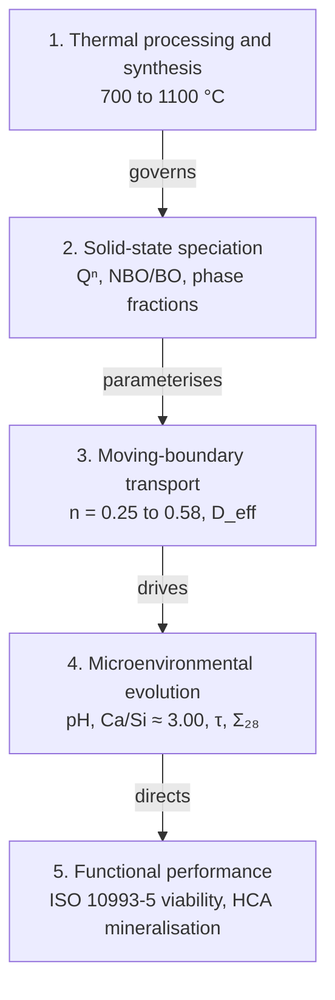

# KineticAI-AWGC: Computational Platform for Predictive Trajectory Engineering

[](#license)
[](https://doi.org/10.5281/zenodo.21759552)


**KineticAI-AWGC** is an open-source scientific computing platform that couples thermal processing, solid-state speciation (Qⁿ, NBO/BO), moving-boundary reaction-diffusion modelling and interfacial cellular bioactivity in bioactive glass-ceramics. It implements the **Kinetic Blueprint Framework**, which describes how thermal processing sets silicate network connectivity and phase assembly, and how these in turn set mass-transport kinetics and the biological response.

---

## 1. Materials system

| | |
|---|---|
| **Platform** | Spray-pyrolysed apatite-wollastonite glass-ceramics (AWGCs) |
| **Composition** | 3CaO·2SiO₂ – 3CaO·P₂O₅ – CaF₂ |
| **Thermal window** | 700–1100 °C (two-stage sinter-crystallisation) |
| **Crystalline phases** | Wollastonite (β-CaSiO₃), whitlockite (Ca₃(PO₄)₂), fluorapatite (Ca₅(PO₄)₃F) |
| **Residual matrix** | Calcium-rich amorphous silicate network, 52.2 wt% (700 °C) down to 22.6 wt% (1100 °C) |

---

## 2. Kinetic Blueprint causal hierarchy



| # | Stage | Physical domain | Inputs | Governing physics | Output state |
|:---:|---|---|---|---|---|
| 1 | **Thermal processing and synthesis** | Solid-state pyrolysis, viscous sintering | Sintering temperature (700–1100 °C), aerosol droplet residence time | Arrhenius crystallisation: $k_{\mathrm{cryst}}=A\,e^{-E_a/RT}$ | Phase distribution; bulk density (2.02 → 2.80 g cm⁻³) |
| 2 | **Solid-state speciation and phase architecture** | Silicate network chemistry | Phase fractions (XRD), NBO/BO (XPS), Qⁿ speciation (²⁹Si NMR) | Network depolymerisation sets hydrolysis rate | Hydrolysis rate constant $k(Q^n)$; reactive amorphous fraction $\alpha$ |
| 3 | **Moving-boundary transport phenomena** | Coupled reaction-diffusion PDE | $D_{\mathrm{eff}}(\varepsilon)$, pore-fluid velocity $u$, specific area $\beta(t)$ | Advection-diffusion-dissolution with moving interface | Korsmeyer-Peppas $n$ (0.25 → 0.58); evolving porosity $\varepsilon(t)$ |
| 4 | **Microenvironmental evolution** | Dynamic interfacial SBF solution | Ion fluxes $J_{\mathrm{Ca}}$, $J_{\mathrm{Si}}$; baseline buffers | Congruent release $[\mathrm{Ca}^{2+}]/[\mathrm{Si}^{4+}]\approx3.00$; $\mathrm{pH}(t)=7.40+\Delta\mathrm{pH}_{\mathrm{exchange}}$ | 28-day dose $\Sigma_{28}$; arrival time $\tau$; interfacial pH |
| 5 | **Functional performance and bioactivity** | Cellular response, mineralisation | $(\tau,\Sigma_{28})$ coordinates; Regenerative Target Zone envelopes | ISO 10993-5 viability (> 70% = non-cytotoxic); HCA nucleation rate $R_{\mathrm{HCA}}(\Omega)$ | HCA surface coverage (13.7–78.4%); osteogenic upregulation (> 300%) |

---

## 3. Governing equations

**Multi-ion transport with moving boundary** (engine implementation is 1D):

$$
\frac{\partial C_i}{\partial t}+\nabla\!\cdot(\mathbf{u}\,C_i)=\nabla\!\cdot\!\big(D_{\mathrm{eff}}(\varepsilon)\,\nabla C_i\big)+S_i-R_i
$$

**Interface regression velocity** (areal fluxes $J_i$, molar masses $M_i$):

$$
v_{\mathrm{int}}=-\frac{1}{\rho_{\mathrm{bulk}}}\sum_i M_i\,J_i
$$

**Release kinetics and stoichiometry:**

$$
\frac{M_t}{M_\infty}=k\,t^{n},
\qquad
R_{\mathrm{Ca/Si}}=\frac{[\mathrm{Ca}^{2+}]}{[\mathrm{Si}^{4+}]}\approx3.00
$$

**Dimensionless regime coordinates:**

$$
\mathrm{Da}=\frac{k^{\circ}_{\mathrm{diss}}\,\alpha\,\beta_0\,L^{2}}{D_{\mathrm{eff}}\,C_0},
\qquad
\mathrm{Pe}=\frac{U\,L}{D_{\mathrm{eff}}}
$$

**Trajectory descriptors** (per ion $i$):

$$
\Sigma_{28}^{i}=\int_{0}^{28}C_i(t)\,\mathrm{d}t,
\qquad
\tau^{i}=\min\left\{t:\ \frac{\int_{0}^{t}C_i(t')\,\mathrm{d}t'}{\Sigma_{28}^{i}}\ge0.50\right\}
$$

---

## 4. Data infrastructure

All raw experimental data live in `data/raw/`.

| Dataset | File | Size | Key variables |
|---|---|:---:|---|
| **Sintering phase kinetics**: phase fractions, bulk density, mass loss, ion release, kinetic exponents | `sintering_phase_kinetics.csv` | 5 × 13 | `Temperature_C`, `Amorphous_Percent`, `Bulk_Density_g_cm3`, `Kinetic_Exponent_n` |
| **In vitro cytotoxicity (ISO 10993)**: triplicate viability across 20–100% extract | `cytotoxicity_iso10993.csv` | 30 × 5 | `Extract_Percent`, `Sintering_Temp_C`, `Cell_Viability_Percent`, `ISO_10993_Status` |
| **SBF pH dynamics**: 21-day interfacial pH time series | `sbf_ph_dynamics_21d.csv` | 14 × 4 | `Time_Days`, `Temperature_C`, `pH_Value`, `Interfacial_Classification` |
| **XRD diffractograms**: intensity spectra across 700–1100 °C | `xrd_diffractograms_2theta.csv` | 6 × 6 | `2Theta_deg`, `Intensity_700C`, `Intensity_1100C` |
| **Surface morphology summary**: SEM degradation and mineral-barrier observations | `surface_morphology_summary.csv` | 10 × 5 | `Sample_ID`, `Sintering_Temp_C`, `Immersion_Days`, `Observed_Surface_Morphology` |

---

## 5. Notebook workflow

| # | Notebook | Scope |
|:---:|---|---|
| 01 | `01_moving_boundary_simulation.ipynb` | 1D moving-boundary solver: strut erosion and concentration fields |
| 02 | `02_da_pe_regime_and_rtz_optimization.ipynb` | Da-Pe regime map and Regenerative Target Zone verification |
| 03 | `03_xrd_crystallization_pathways.ipynb` | Rietveld phase refinement and Qⁿ tracking |
| 04 | `04_ion_release_stoichiometry.ipynb` | Ca/Si congruent ratio and HCA precipitation sink |
| 05 | `05_in_vitro_biocompatibility.ipynb` | ISO 10993 cytotoxicity and extract-concentration thresholds |

---

## 6. Repository audit and documentation

`src/project_summary.py` holds the platform manifest. Running it checks that every registered dataset exists, prints a terminal summary, and regenerates `docs/PROJECT_SUMMARY.md`.

```bash
python -m src.project_summary
```

---

## Citation

Please cite the archived release: **doi:10.5281/zenodo.21759552**

## License

MIT
